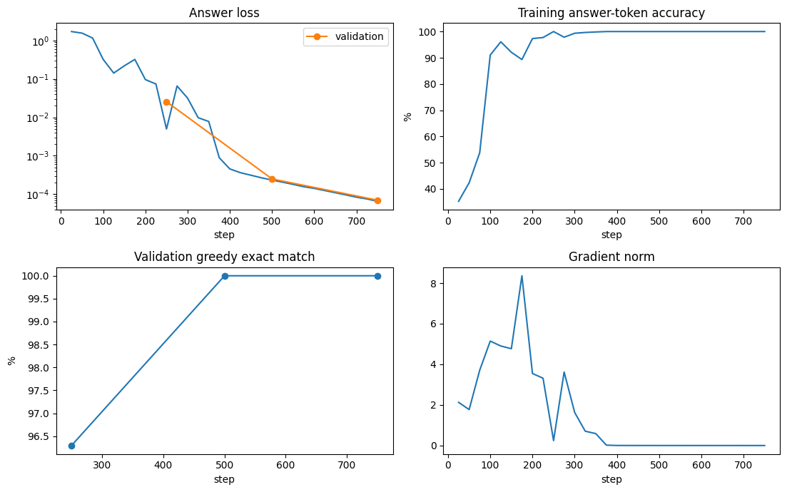
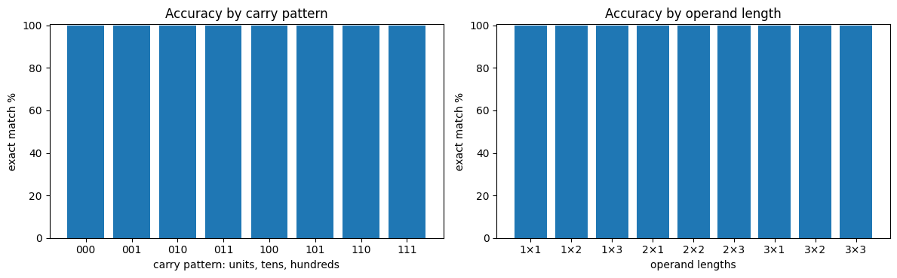

# JAX Addition Transformer

[](https://colab.research.google.com/github/marcoharuni/jax-addition-transformer/blob/main/notebooks/01_build_train_exact_10m.ipynb)

A decoder-only transformer with exactly **10,000,000 trainable parameters**, written from scratch with JAX primitives and Flax NNX, and trained to add every ordered pair of integers from 0 through 999.

## Verified result

The default model was trained on a Google Colab NVIDIA T4 and evaluated by greedy autoregressive generation over the complete one-million-pair domain.

| Measurement | Result |
|---|---:|
| Parameters | 10,000,000 |
| Training steps | 750 |
| Training time after JAX compilation | 6.89 minutes |
| Validation | 20,000 / 20,000 |
| Unseen test | 780,000 / 780,000 |
| Complete domain | 1,000,000 / 1,000,000 |
| Carry-pattern slices | 100% in all 8 patterns |
| Operand-length slices | 100% in all 9 combinations |
| Invalid generations | 0 |
| Failures | 0 |

The exhaustive evaluation took 144.31 seconds. Machine-generated measurements are stored in [`artifacts/t4-run`](artifacts/t4-run).

This result is limited to the fixed domain `0..999` and the representation described below. It is not a claim about four-digit or arbitrary-length addition.

## Training

The model reached 100% validation exact-match accuracy by step 500 and stopped at step 750 after achieving perfect validation accuracy twice.



## Exhaustive evaluation

The saved checkpoint was evaluated with greedy autoregressive decoding across every ordered pair from `0 + 0` through `999 + 999`.

- 1,000,000 / 1,000,000 complete-domain additions correct
- 780,000 / 780,000 unseen test additions correct
- 0 incorrect answers
- 0 invalid generations
- 100% accuracy for every carry pattern
- 100% accuracy for every operand-length combination



## Task representation

Every complete record has 16 characters:

```text
123 + 456 = 9750
```

The operands are zero-padded to three digits. The normal four-digit answer `0579` is reversed to `9750`, so a causal model generates the units digit first and follows the direction of carry propagation.

The vocabulary contains exactly 13 characters:

```text
0 1 2 3 4 5 6 7 8 9 space + =
```

There is no padding token. Training uses shifted next-token targets, but loss is applied only to the four answer positions.

## Default architecture

| Setting | Value |
|---|---:|
| Decoder blocks | 5 |
| Model width | 320 |
| Attention | 5-head MHA |
| Head dimension | 64 |
| FFN width | 2,480 |
| Normalization | Pre-LayerNorm |
| Activation | GELU |
| Positions | Learned absolute embeddings |
| Token/output weights | Tied |
| Bias / dropout | None / 0 |
| Parameter storage | FP32 |
| T4 matrix inputs | FP16 with FP32 accumulation requested |

Exact parameter count:

```text
attention per block     4 × 320 × 320                   =   409,600
FFN per block           2 × 320 × 2,480                 = 1,587,200
two LayerNorms          2 × (320 scale + 320 bias)      =     1,280
five blocks             5 × 1,998,080                   = 9,990,400
tied token embedding    13 × 320                        =     4,160
position embedding      15 × 320                        =     4,800
final LayerNorm         320 scale + 320 bias            =       640
total                                                       10,000,000
```

The notebook asserts this count against the actual NNX parameter tree before training.

## Data and optimization

The complete domain contains `1,000 × 1,000 = 1,000,000` ordered pairs.

| Split | Pairs |
|---|---:|
| Training | 200,000 |
| Validation | 20,000 |
| Unseen test | 780,000 |

The deterministic seed-42 split is stratified by operand lengths and carry pattern. Each training batch combines uniform examples with carry-balanced examples.

The optimizer is AdamW with:

```text
peak learning rate   1e-3
warmup               100 steps
schedule             cosine decay
final learning rate  1e-4
beta1 / beta2         0.9 / 0.99
global-norm clipping 1.0
weight decay          0.1 on attention and FFN matrices only
```

## Run in Colab

Open [`notebooks/01_build_train_exact_10m.ipynb`](notebooks/01_build_train_exact_10m.ipynb), select **Runtime → Change runtime type → T4 GPU**, and run the notebook from top to bottom.

The notebook visibly implements:

- tokenizer and fixed-width dataset;
- deterministic split and balanced sampler;
- linear layers, LayerNorm, causal MHA, GELU FFN and transformer blocks;
- answer-only loss and AdamW training;
- training and validation curves;
- checkpoint save and restore;
- exhaustive evaluation over all 1,000,000 additions;
- interactive model inference.

No pretrained weights, external transformer implementation, calculator call, or hidden repository import is used in the notebook's core model.

## Local development

```bash
uv sync --group dev
uv run pytest -q
uv run ruff check .
uv run jat-inspect --config configs/exact_10m_t4.json
```

The tested CPU suite contains 33 tests covering formatting, tokenization, carries, splitting, sampling, attention causality, parameter counting, loss masking, optimization, checkpointing, resume behavior and notebook validity.

## Artifacts

Committed run artifacts:

```text
artifacts/t4-run/history.json
artifacts/t4-run/results.json
artifacts/t4-run/failures.csv
```

The trained checkpoint is approximately 40 MB and should be published as a GitHub Release asset rather than committed to the repository.

## Scope

This is an arithmetic language-model experiment, not a general chatbot. Its verified claim is exact greedy generation across the complete fixed three-digit addition domain represented by this notebook.

## License and author

MIT © 2026 Marco Haruni.
